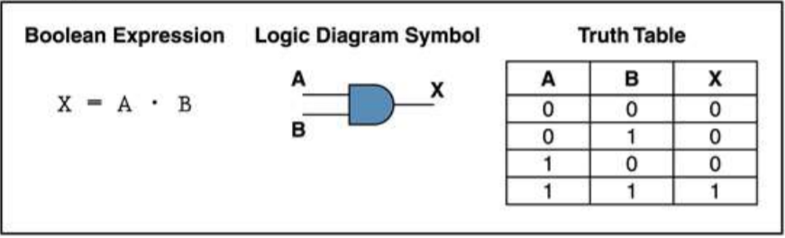
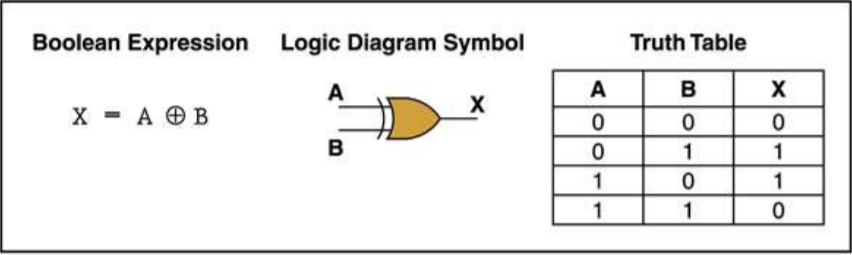
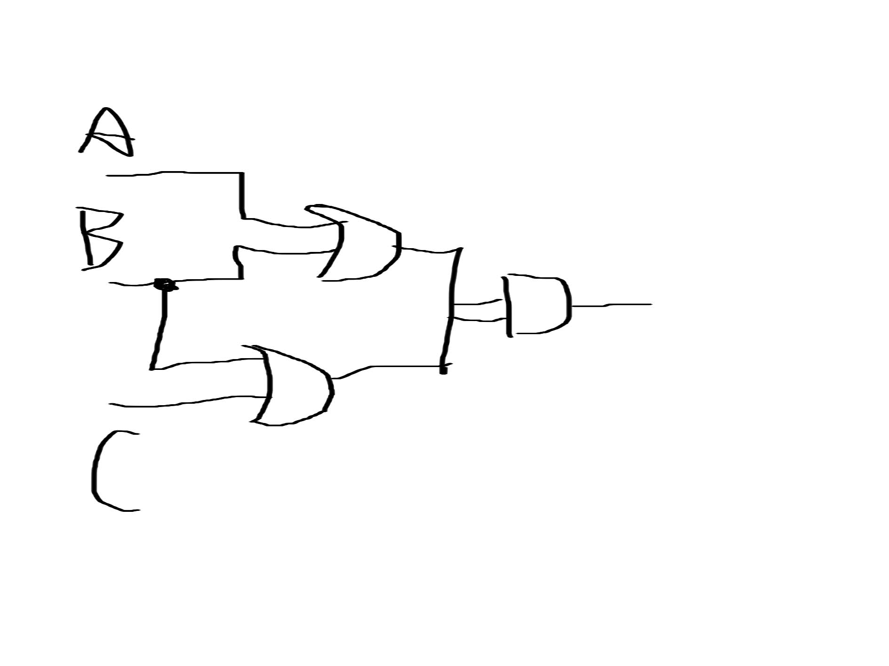

# part 1 of 2
## 1) 

## 2)

## 3)

## 4)
|A|B|A'|AB|(AB)O+A'|
 |:-:|:-:|:-:|:-:|:-:|    
 |0|0|1|0|1|
 |0|1|1|0|1|
 |1|0|0|0|0|
 |1|1|0|1|1|

 ## 5)
 |A|B|AB|(AB)'|A'+B'|
 |:-:|:-:|:-:|:-:|:-:|    
 |0|0|0|1|1|
 |0|1|0|1|1|
 |1|0|0|1|1|
 |1|1|1|0|0|
 
# part 2 of 2
 ## 6)

 ## 7)
(1) (X8X7X6X5X4X3X2X1)2 or (00001111)2 = (X8X7X6X51111)2 
(2) (X8X7X6X5X4X3X2X1)2 xor (00001111)2 = (X8X7X6X5X4'X3'X2'X1')2 
(3) ((X8X7X6X5X4X3X2X1)2 and (11110000)2 )or (not (X8X7X6X5X4X3X2X1)2 and (00001111)2) = (X8X7X6X5X4'X3'X2'X1' )2

# part 3 of 3
## 1)Logic gate
In electronics, a logic gate is an idealized or physical device implementing a Boolean function; that is, it performs a logical operation on one or more binary inputs and produces a single binary output.

## 2)Boolean algebra
In mathematics and mathematical logic, Boolean algebra is the branch of algebra in which the values of the variables are the truth values true and false, usually denoted 1 and 0 respectively. Instead of elementary algebra where the values of the variables are numbers, and the prime operations are addition and multiplication, the main operations of Boolean algebra are the conjunction and denoted as ∧, the disjunction or denoted as ∨, and the negation not denoted as ¬. It is thus a formalism for describing logical relations in the same way that elementary algebra describes numeric relations.

## 1)Flip-flop 中文翻译是？
触发器

## 2)How many bits information does a SR latch store?
