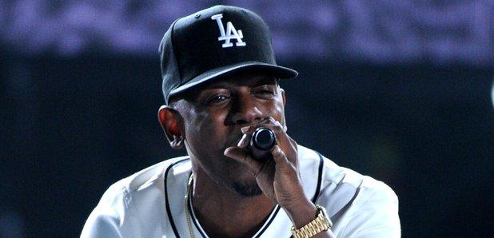
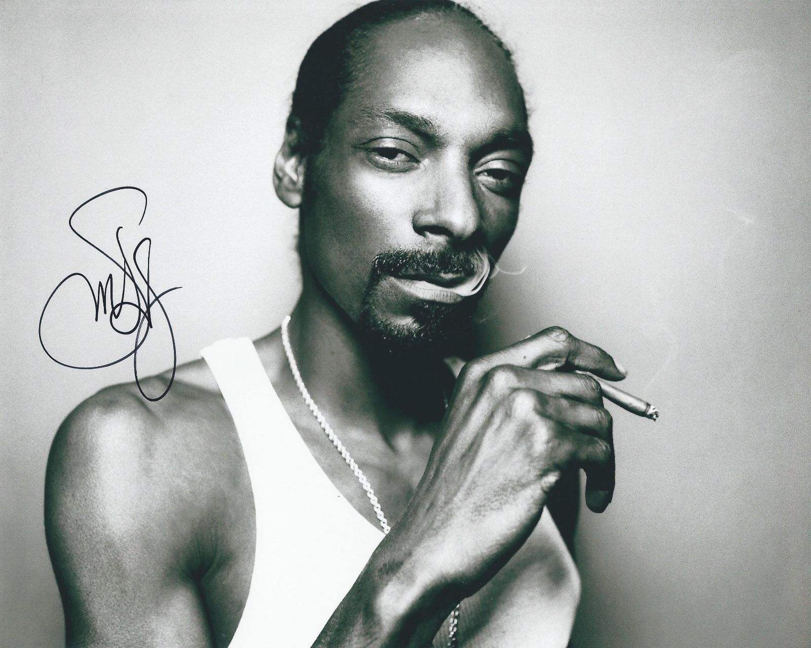
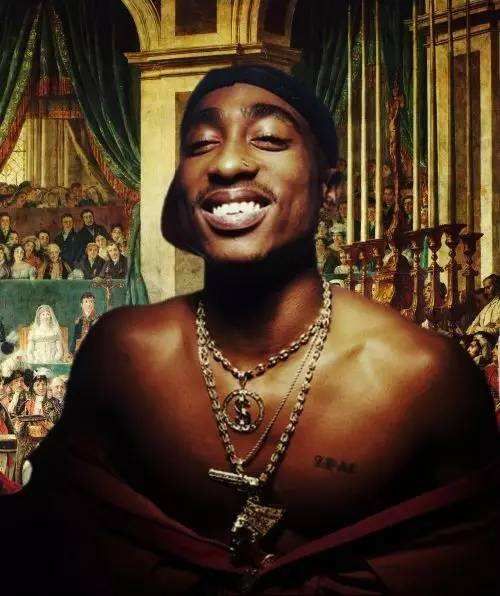
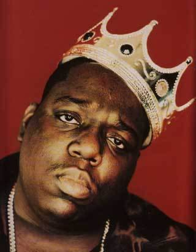
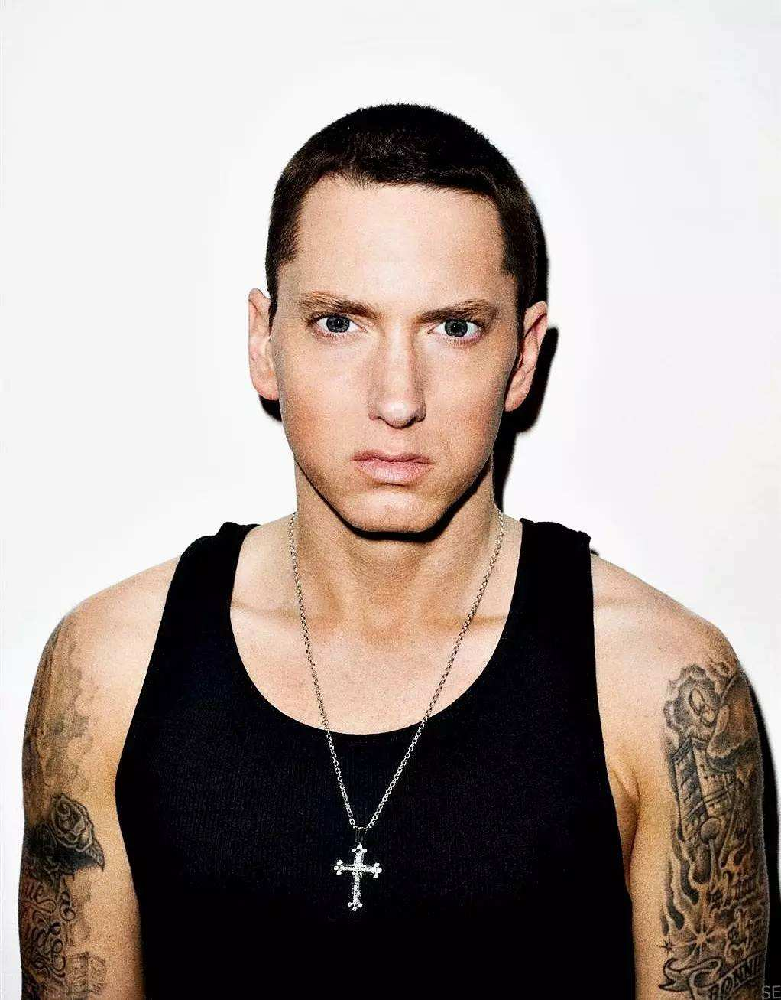
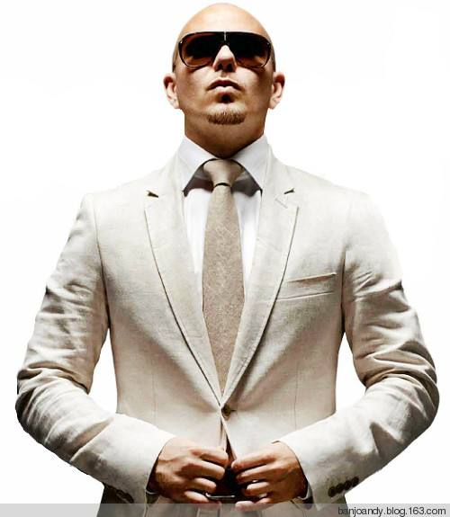
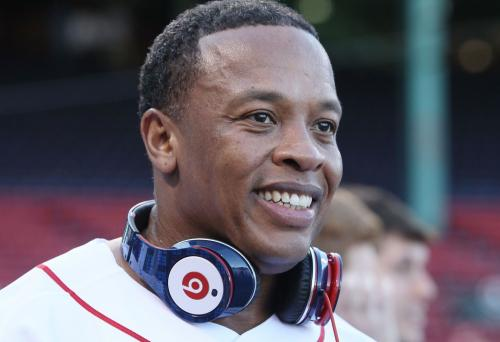

# 第一次写博客0.0

第一次写博客噢~不知道可以写点什么，就写一下自己比较喜欢的一个文化吧。
相信大家都听过或看过《中国有嘻哈》吧。不得不承认这个节目确实为这一在西方国家诞生并发展的文化开始较为广泛地流行起来，对此我也颇感欣慰，自己喜欢的文化可以在身边普及。
不过呢~我是一名欧美范，从一开始听欧美流行音乐慢慢了解到说唱这种音乐种类，因此对中国的说唱现况与发展不甚了解，因此我只能浅谈一下我眼中的欧美说唱啦~
因为篇幅问题和我比较懒的原因，第一篇博客我就简单介绍一下几种比较主流的说唱类型，若有不严谨之处，欢迎指出。
以下某几种说唱类型名称虽不同，但风格相似，界限并非太明显，因此几种说唱类型也是相通的，并非泾渭分明。

（以下部分内容引用百度百科相关链接）

黑帮说唱（Gangsta Rap）
首先介绍黑帮说唱。这类说唱类型盛行于上世纪八十年代晚期至约2005年。众所周知，说唱源于黑人生活区的街头，美帝的特殊环境也催生了这类说唱文化的流行，美国说唱圈也曾一度被黑帮占据大片江山。这类说唱的歌词大多涉及暴力、内幕、毒品交易等内容，因此饱受争议，但不可否认黑帮说唱是说唱文化的重要组成部分。
代表人物：2Pac,Ice cube, Snoop Doggy Dogg	

西海岸说唱乐（West Coast Rap）&东海岸说唱乐（East Coast Rap）
之所以将两者放在一起介绍，是因为在说唱历史上曾发生过一次影响颇大的东西海岸说唱之争，这次斗争还直接导致了两大殿堂级rapper（Biggie、2Pac）的离世。 两种说唱类型在风格上也略有不同，东海岸说唱具有更有棱角的节奏和严谨有力的韵律，而西海岸说唱使用更 funky 的独特节奏，支持着流畅的、有旋律的曲调。
代表人物：2Pac，50cent，kendrick lamar（西海岸）
          Biggie，Nas，Jay-Z（东海岸）

硬核说唱（Hardcore Rap）
说到硬核说唱大家或许不曾听闻，但Eminem大家一定有所耳闻，他强硬的嗓音和充满攻击性的歌词一定让大家印象深刻。硬核说唱就是这样一种极具力量感的说唱方式，往往表现热情奔放的主题，用猛烈强劲的鼓点和吵杂的取样与制作完成说唱。
代表人物：Eminem

拉丁说唱（Latin Rap）
说唱文化并非美国本土独有，自从说唱一开始，就有来自拉丁圈子的说唱，但是它直到很晚才闯入流行主流。 拉丁说唱曲风比较有拉丁味道，有时候会加入西班牙的吉他，拉丁鼓，康加鼓，小喇叭等。这种说唱风格与上述几种风格差别十分鲜明，韵律感相比更强，更容易让大众接受。
代表人物：Pitbull

老派说唱乐（Old School）
顾名思义，老牌说唱乐诞生于说唱初创的时期。这类说唱节拍直接，没有嘈杂的伴奏，rapper的发声较平和，歌词内容也不会太过尖锐敏感。“老学校”说唱接近流行音乐，时至今日仍倍受rapper和听众青睐。
代表人物：Mc Ren，Dr. Dre, Eric B. & Rakim

写到这里挺晚了~说唱类型其实还有很多，但我个人没有全部了解也并未深入了解，因此点到为止，有兴趣的同学可以继续了解哦~那先这样啦
