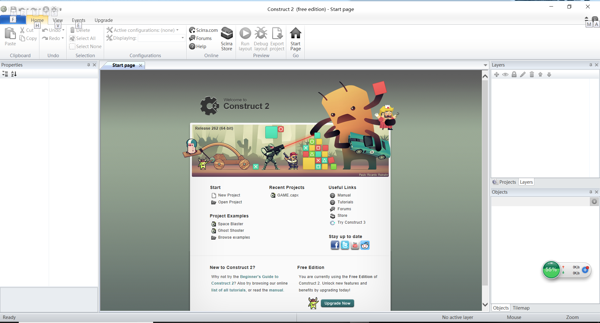
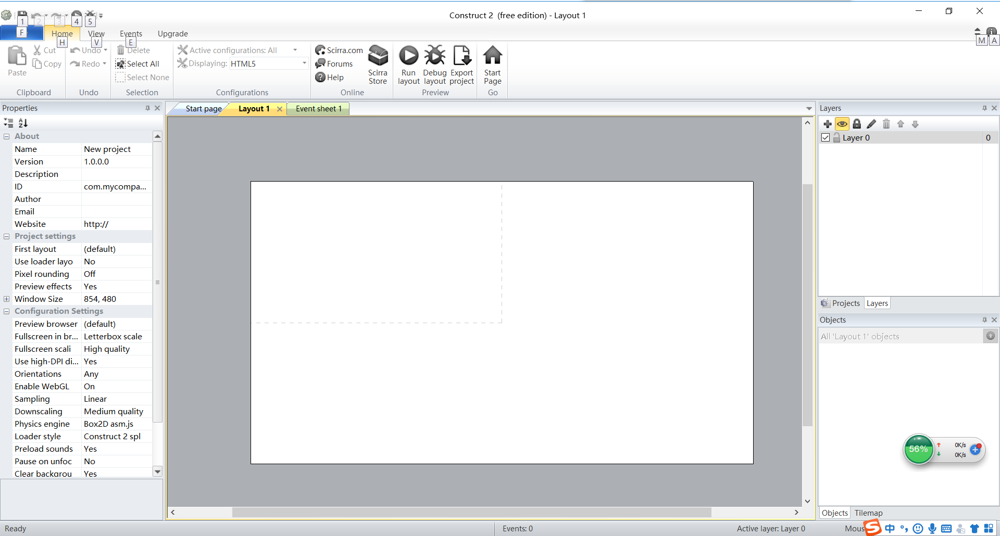
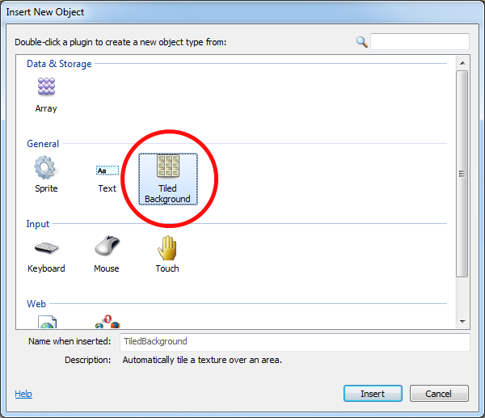
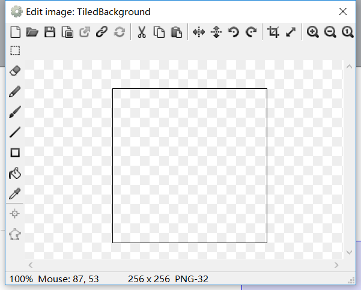
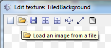
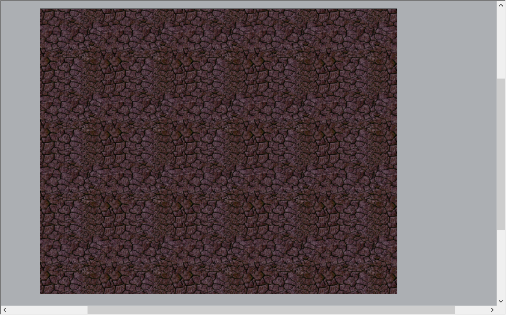
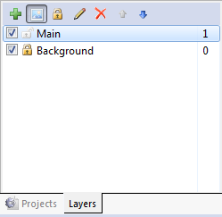
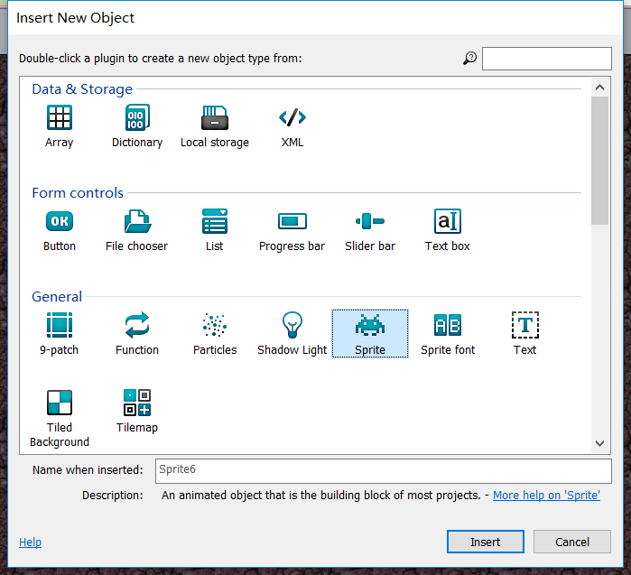
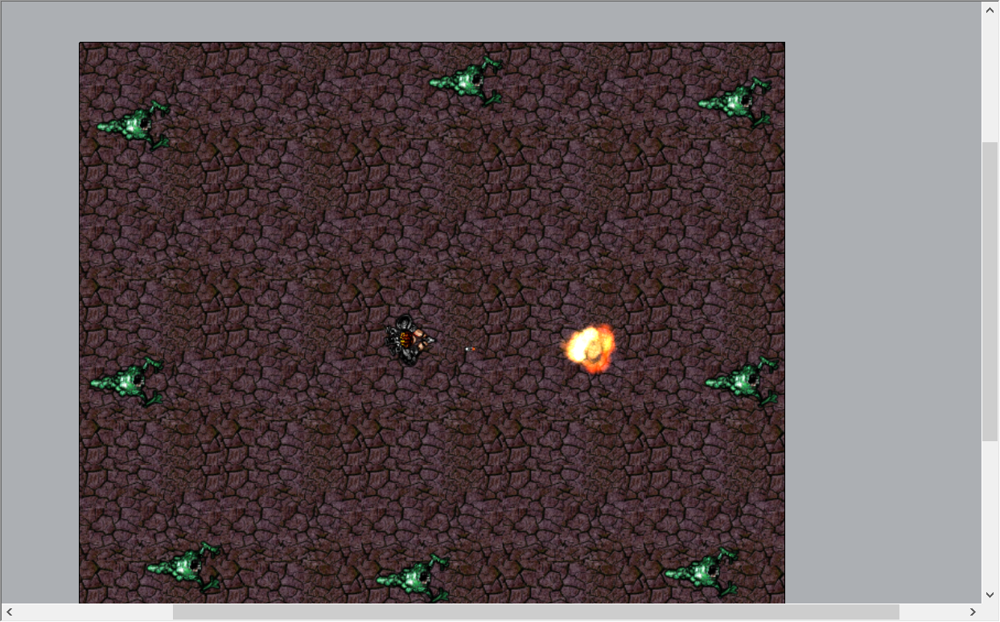

# 制作 HTML5 游戏
今天第一次制作 HTML5 游戏，浅谈一下添加背景与角色的小心得。
## 软件准备
同样作为初学者的我在老师引导下下载了Construct2进行制作。 
以下为下载链接 
 https://www.scirra.com/construct2 

 ## 构建文件
 安装完成后打开construct2可以看到以下界面 
  
 点击左上角file，选择new，会弹出如下窗口 
 
点击new empty project 
 

## 添加背景
此时可见界面中央出现一张略显单调的白布，对此我们可以为游戏添加背景 
 
双击白布，弹出如下窗口，点击红圈中的图标 
 
此时鼠标变为一个十字，点击大约白布中央的位置，弹出如下窗口 
 
点击左上角黄色文件图标 
 
此时你可根据图片路径，选择你计划中的背景 
完成背景插入后发现图片并未完全填充白布 
此时，选定背景图片后在界面左侧选择找到size一栏，更改图片大小（白布默认大小1280*1024） 
 
效果如图 

背景完成，可通过ctrl+鼠标滑轮控制视野大小。 

## 添加角色
### 增加图层
游戏中角色与背景应该不在同一层面活动，因此我们将两者分层更易于操作，也能有效防止误触，此作用与Photoshop类似。 
在界面右侧点击layers 
  
将背景所在的图层更名为background，并点击左侧锁图标锁定该图层。点击加号增加图层，此处命名为main。 
 
### 插入角色
完成图层建设后便可加入角色 
双击背景选择Sprite，并点击你需要加入角色的初始位置 
 
效果如图 
 

## 这次分享先到这，后续更新
