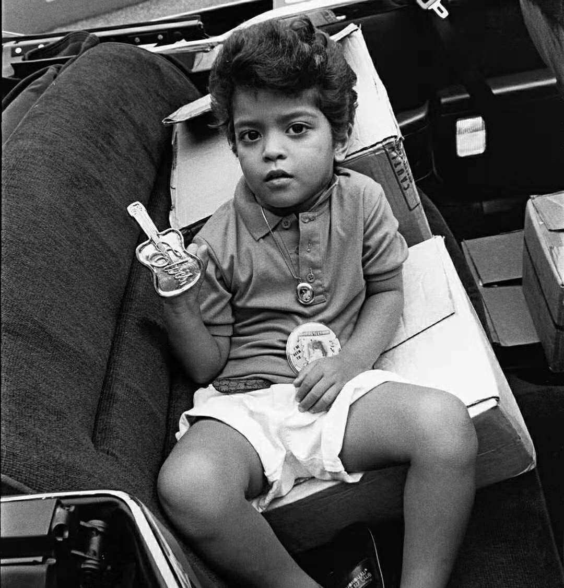
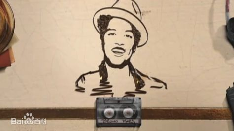
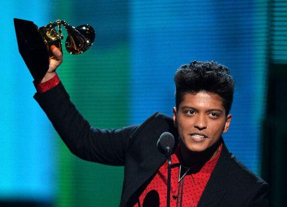
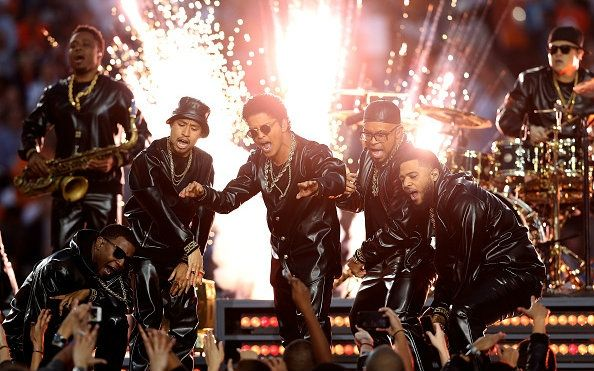
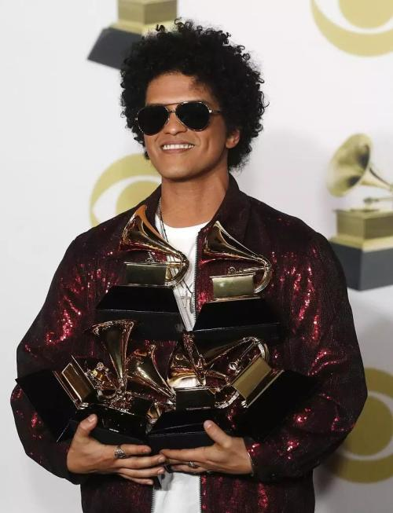

## My Idol
给大家介绍一下我的偶像 Bruno Mars 
 
Bruno Mars原名Peter Gene Hernandez,1985年10月8日出生于美国夏威夷檀香山。因其名字中Mars一词意为火星，于是国内粉丝喜欢称他为“火星哥”。
火星哥在幼年便展现出过人的音乐才华。他热衷于模仿红极一时的猫王和MJ。其早年多次登台表演的经历也为他日后的歌手生涯奠定了基础。 
 
火星哥于2010年以歌手身份出道，此前一直以作曲人的身份在歌坛颇负盛名。其创作的歌曲中不乏传唱度极高的金曲。 
同年10月，火星哥发布第一张个人专辑《Doo-Wops & Hooligans》。这张专辑大家或许不曾听闻，但其先发单曲《Just the way you are》相信大家一定听过甚至会唱。这位音乐奇才从此走入大众的视野。 
 
此后火星哥连发新专，质量颇高，被誉为“金曲制造机”。《locked out of heaven》、《it will rain》、《Grenade》、《when I was your man》等单曲一度进入B榜前五。 
火星哥不仅录音室作品广为流行，其现场表演堪称一绝。他曾多次登台格莱美、公告牌等颁奖典礼表演现场，两度亮相超级碗的中场秀。其稳健的唱腔和动感的舞姿深受观众喜爱。有粉丝甚至感叹“MJ再世”。 
 
2014年，火星哥凭借专辑《Unorthodox Jukebox》获得第56届格莱美最佳流行专辑奖。但除此之外火星哥的格莱美之旅一度是“多提不中”。 
 
此后火星哥一度没有更新专辑，但随后，他与Mark Ronson合作的“抖腿神曲”《Uptown Funk》横空出世，席卷全球各大榜单，其在2016年超级碗中场秀上的表演更是赚足眼球。 
 
沉寂了许久，万众期待的火星哥新专辑终于到来。《24K Magic》伴随着火星哥从情歌小王子到舞动精灵的转变问世。其中《That's what I like》更是登顶BILLBOARD。更重要的是，长时间“陪跑”的火星哥凭借这张神专横扫2018年格莱美的七个奖项！ 
 
对于我的teenage idol我先在此搁笔，我对他的喜爱更是难以用言语形荣。你很难不爱上一个每首单曲都让你循环，每次现场演出都给你惊喜的歌手。 