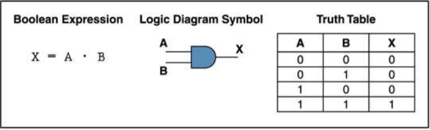
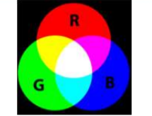

# 计算机色彩显示 
我们在享受计算机给我们生活带来便利的同时，是否曾想过计算机如何能如此神通广大，无所不能。例如，为我们呈现缤纷的计算机显示屏是如何将诸多0和1的组合转化为色彩的呢？ 
 
今天就为大家简单介绍一下色彩的显示原理。 
首先我们看到的图像并非现实中我们所见的一个个物体的真实还原。而是由一个个有对应颜色的“点”堆砌而成的，这一个个点则是像素点。像素则是像素的个数。像素越高，照片的组成色彩点就越多，照片就越清晰。 
 
 
而颜色多达上千种，电脑如何将其区别开来，分配给每个色素点呢？ 
 
其实我们看到的众多颜色，都可以通过简单的三种颜色按不同比例混合而成。这三种颜色便是红、绿、蓝。 
 
三种颜色的比重可以通过数字表示，范围为 0~255（2的8次方），占用一个字节（1 byte）。一个颜色通过三种颜色按配比合成得到，因此一种颜色占用了三个字节。 
 
计算机内一张图片占用的空间大小则取决于其像素点的多少。而同一张照片的不同的照片格式通常有不同的大小。