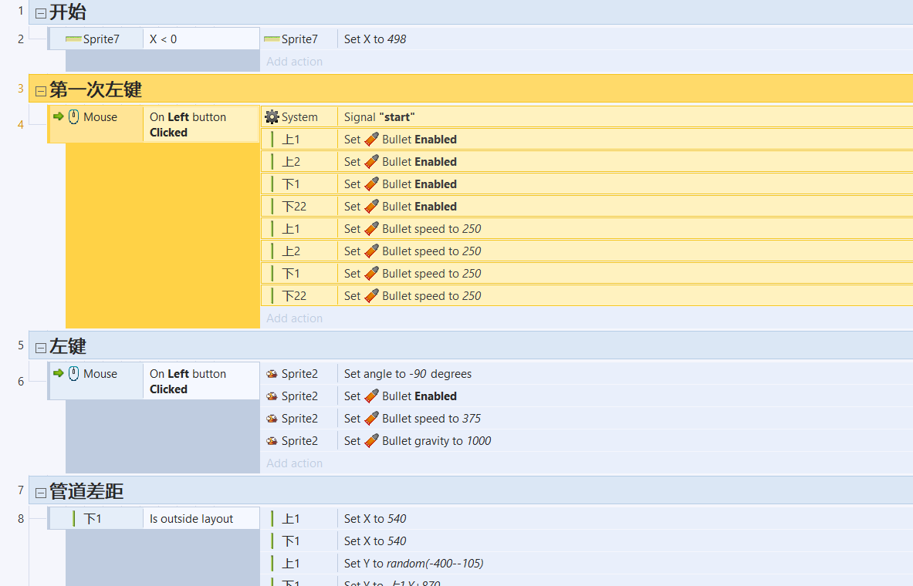
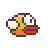

# 游戏设计

## 游戏的策划
曾经一段时间火遍全国的手机游戏flappy bird因其简单的玩法、令人不忍放弃的机制深受许多玩家喜爱。不幸的是，该游戏已从App Store下架，让后来的玩家无法玩到这款游戏，令人惋惜。因此我打算粗略重制这款游戏，重温这款经典的游戏。
角色：flappy bird
玩法：通过点击鼠标左键让flappybird跳跃起来以防止碰到管道，一旦碰到管道flappy bird将死亡。

## 游戏设计

### 1：flappy bird 
 
 Attributes:(30,256) 
 Collaborator ：land，pipe 
 Events & Actions：碰撞 & 下坠 

 ### 2：pipe 
  
 Attributes:(540,random) 
 Collaborator: flappy bird 
 Events & Actions：向左移动，碰撞;到达图层边缘返回位置(540,random)，上下管距离保持250 

 ### 3:background 
 
Attributes:(0,0) 
Collaborator:无 
Events & Actions：无 

### 4：land 
 
Attributes:(256,450) 
Collaborator:flappy bird 
Events & Actions：碰撞，向左运动，到达图层边缘返回位置(256,450) 