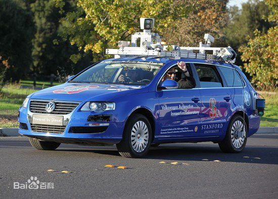
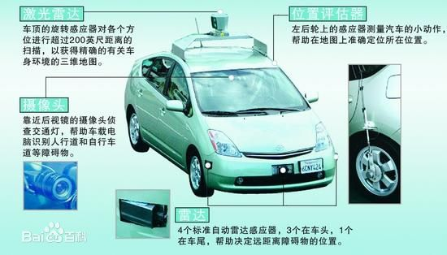
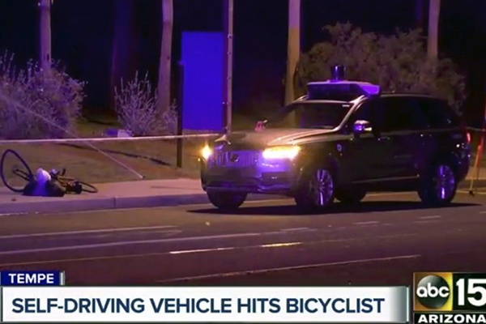
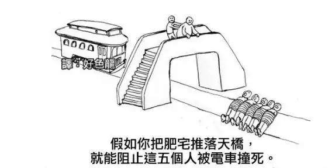

# 自动驾驶引发的伦理问题
随着人工智能科技的飞速发展，我们生活中的方方面面都因得到了AI的帮助而变得方便快捷。如果在数十年前有人提出可以自动驾驶的汽车，那或许会是天方夜谭。然而，自动驾驶作为诸多人工智能技术的集大成者已然出现在人们视线。

自动驾驶的出现无疑是技术创新的一次突破，固然值得欢呼喝彩。然而，万事皆具有两面性。自动驾驶为交通出行开拓出新思路，同时也带来了有关的伦理问题。

## 交通事故谁之过？
2016年5月7日，美国俄亥俄州坎顿市的前海军海豹突击队员约书亚·布朗（Joshua Brown）驾驶Model S在佛罗里达州威利斯顿附近的双向高速公路上行驶时，与一辆拖挂车相撞，不幸身亡。这是全球第一起因自动驾驶而致死的事故。
事后，美国国家高速公路交通安全管理局（NHTSA）针对Autopilot功能展开调查。经过半年的调查，NHTSA于2017年1月19日宣布，未发现Autopilot功能存在问题，同时不会要求特斯拉对汽车进行召回。NHTSA的结论是，特斯拉Autopilot不是完全自动驾驶系统，它根本无法应对所有路况，司机不应该依靠它来防止此类事故。

自动驾驶致死事件无疑像一颗定时炸弹，在自动驾驶汽车问世的一刻就点燃了导火索。那么此类事件一旦发生，谁又该为交通事故负责？若应声讨驾车司机，驾车司机的双手却不在引发事故的方向盘上；若要谴责自动驾驶的研发公司，自动驾驶车辆的性能却也经过相关审核而合法合理上路的。
对此，不少国家已经完善相关的法律。
2017年10月12日美国加利福尼亚州车辆管理局宣布，从2018年6月起允许没有方向盘、制动踏板、后视镜和没有驾驶员的无人驾驶汽车在道路上进行测试，允许公众乘坐配有无人驾驶技术的车辆。所有上路测试的自动汽车都属于L3级自动驾驶汽车，在某些情况下依然还需要人工干预。
2017年5月12日，德国联邦参议院通过首部自动驾驶汽车的法律，允许汽车自动驾驶系统未来在特定条件下代替人类驾驶。这部法律首先明确了法律责任，如果在人为驾驶的情况下发生事故，驾驶人承担事故责任；如果是人工智能系统引发事故，将由汽车制造商承担责任。

## 利益的权衡？
自动驾驶汽车要面临一种选择，即电车难题——最早由英国哲学家菲利帕·福特（Philippa Foot）在1967年发表的《堕胎问题和教条双重影响》中提出。但是，更早则起源于伯纳德·威廉姆斯提出的枪决原住民问题。一名独裁者以涉嫌叛乱为由要处决20名无辜的印第安人，此时有一名外来旅游的科学家在场，独裁者称如果由科学家亲手枪决1名印第安人，就可以赦免19人，那么这名科学家该不该这么做？

一旦自动驾驶汽车上路，必然面临这种伦理难题，也就是让汽车在事故之前选择杀一人还是杀几人的问题，并且，人工智能的设计可能会陷入无尽的矛盾中。倘若自动驾驶系统加入了对于利益的权衡与计算，那么也就注入了人类对于不同阶层、不同地位的人的区别对待。若一场车祸中必须让一位高知识水平的科学家与一名无家可归的流浪汉其中一位丧命，那么无论自动驾驶作出怎样的选择都将有悖于尊重生命、人人平等的社会法则。