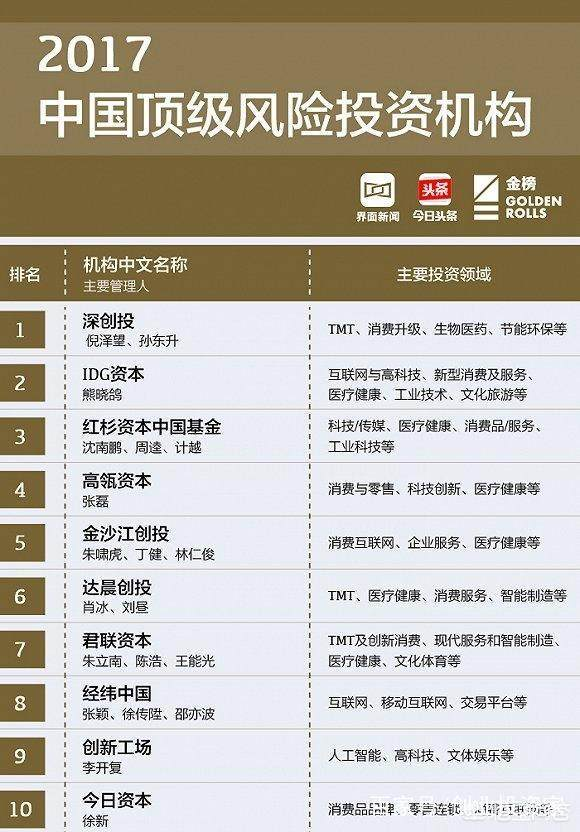

# 关于IT行业风投
## 定义
### IT
信息技术（Information Technology，缩写IT），是主要用于管理和处理信息所采用的各种技术的总称。它主要是应用计算机科学和通信技术来设计、开发、安装和实施信息系统及应用软件。它也常被称为信息和通信技术（Information and Communications Technology, ICT）。主要包括传感技术、计算机与智能技术、通信技术和控制技术。 
                                                 （百度百科）

### 风投
风险投资（英语：Venture Capital，缩写为VC）简称风投，又译称为创业投资，主要是指向初创企业提供资金支持并取得该公司股份的一种融资方式。 
                                                 （百度百科）

## 风投与中国

由上图可看出，中国各大风投机构致力于投资IT行业，这得益于IT行业在中国蓬勃发展的趋势。 

IDG资本已经在中国投资了超过600家公司，包括腾讯、百度、搜狐、搜房、宜信、小米、携程、金蝶软件、奇虎360、传奇影业、暴风科技、91手机助手、如家酒店集团、汉庭酒店集团、网龙科技、当当网、乌镇、古北水镇、印象创新、爱奇艺 、美图、周黑鸭、美团 、哔哩哔哩bilibili 、雷蛇  猿题库、蓝港互动、蘑菇街、贝贝网、纷享逍客、找钢网、金山云、康辉医疗、九安医疗、武汉华灿光电、拼多多 、蔚来汽车等公司，已有超过150 家所投公司公开上市或并购。（百度百科） 

以上IDG投资的众多企业有许多诸如腾讯、百度等知名IT公司。凭借飞速的发展速度，IT行业拥有不俗的发展前景，这也使IT倍受风投公司青睐。 

风投公司提供的资金支持与国内IT人才提供的技术支持相辅相成，才能推动中国IT盛景的问世。如今中国的IT行业技术水平与发达国家仍有相当差距，但若中国风投巨头能保持对IT行业的资金输出，IT人才也持续输出新的创新成果，保持IT行业的飞速发展，前景仍是乐观的。 